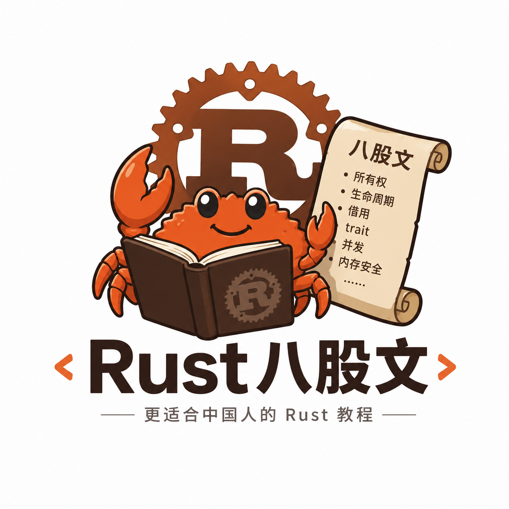
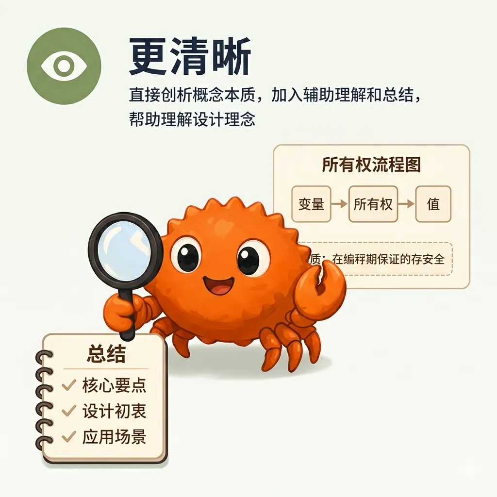

<div align="center">



<div style=" padding: 0 64px;
  display: flex;
  justify-content: center;
  align-items: center;
  flex-wrap: wrap;
  gap: 10px;">
  




</div>

<br/>

   

</div>

## 教程介绍

这个教程是根据 [官方 Rust 教程](https://doc.rust-lang.org/stable/book/index.html) 、视频资料和相关书籍 **整理** 而成的 **Rust入门教程** ，章节结构顺序基本参照官方教程，但融入了合理的调整和补充,以减轻学习难度。某些章节也加入了知识点的补充和个人理解。你可以独立阅读此教程，也可以配合官方教程使用。

我的目标是让这个教程成为一个**更符合中国人学习习惯的 Rust 入门资源**，降低学习难度，提供更清晰的概念解释和逻辑顺序,也希望成为 Rust 学习者的枕边书,遇到概念上的问题随时查找.

之所以叫八股文,是因为本教程比较干,比较死板,总是在讲解概念的本质、语法,然后再举例说明.也是对这个教程的一种调侃.

## 目前进度

**✅ 已完成**

- 已完成所有章节的整理,可以进行[在线阅读](https://rust8.cn/)
- 根据知识点的逻辑性,进行合理的顺序调整
- 难点章节的额外补充和讲解

**⏳ 进行中...**

- 章节内容的细节调整和完善
- 术语的高亮链接整理

## 为什么要整理这个教程

我本身喜欢做笔记,同时在学习的过程中发现了一些对初学者不友好的问题,本质原因是目前国内 Rust 的商业动力不够强,所以人们的动力也就不够强,我就顺便将自己的笔记整理成了更详细的教程,为Rust在国内的发展提供绵薄之力。

现有的 Rust 教程资源虽然众多，但存在几个问题：

- 中文资源较少，多数是翻译作品，表达方式不符合中文学习逻辑
- 大多教程默认读者有系统开发基础，缺乏必要的前置知识说明
- Rust 学习曲线陡峭，现有教程在重难点讲解上不够充分,尤其是最后几章的高级部分,很不友好

本教程采用**中国教科书式**的讲解方式：**先阐明概念本质，再举例说明**，同时根据知识点的逻辑关系重新梳理顺序，希望能降低学习难度。

## 教程整理方式

本教程使用 `Claude Sonnet 4.6` 辅助整理,整理流程如下:

1. 根据官方教程和视频资料,手动对每个章节的内容进行要点提取和归纳,确保自己理解每个知识点。
2. 将提取的要点进行逻辑梳理和顺序调整,以便于进一步理解
3. 理解过程中遇到难以理解的概念,会询问AI,然后将AI的回答中有价值的部分进行总结和提炼,加入到教程中.大部分知识点的补充都是以这种方式添加
4. 个人的理解和总结也在经AI验证后加入到教程中,以确保准确性和清晰度
5. 当章节完善的较好后,会使用AI对整个章节进行错误检查

> AI 主要负责解答问题、提供补充内容和错误检查,不进行章节内容的直接生成,这样我自己才能更好地理解和把控教程的内容.

## 本教程的主要优势

- **更易学**：遵循"概念→原理→示例"的教学逻辑，符合中文学习习惯
- **更完整**：覆盖 Rust 核心知识点，对难点章节进行补充和详细讲解
- **更清晰**：直接剖析概念本质，加入辅助理解和总结，帮助理解设计理念
- **更逻辑**：按照知识逻辑重新梳理顺序，帮助理解和记忆

## 学习前置条件

本教程不要求你有 `C/C++` 等系统级语言基础，也不要求你深入理解内存堆栈。但完全零基础学习的难度会更高，某些知识点需要基础计算机科学知识作为前置知识。

## 学习方式

本教程采用现代化的 [VitePress](https://vitepress.dev/zh/) 构建,页面**左边**是总的章节目录，**右边**是章节目录大纲。手机和 PC 端都做了适配,你可以点击目录中的章节标题来快速查看对应的内容。每个章节都包含了概念解释、原理分析和示例代码，帮助你更好地理解 Rust 的设计理念和使用方法。

网站顶部的**搜索框**可以帮助你快速查找相关知识点,输入关键词后会显示相关章节的链接,点击后会跳转到对应的章节内容.

对于一些概念性的术语,会有**链接高亮**,点击后会跳转到相关章节的解释,方便你快速理解和查找相关知识点.

## 建议和修改

个人难免有理解偏差和表达不清的地方，希望宽容.如果你发现了任何问题或者有更好的建议，欢迎提交 [issue](https://github.com/georgetime1970/rust8.cn/issues) 来改进这个教程。

## 支持与贡献

如果你觉得这个教程对你有帮助，欢迎给它([Rust 八股文](https://github.com/georgetime1970/rust8.cn/))一个 star ⭐，或者分享给更多的 Rust 学习者。如果你想参与改进这个教程，也欢迎提交 [pull request](https://github.com/georgetime1970/rust8.cn/pulls) 来贡献你的想法和修改,我比任何人都需要你。

非常感谢以下贡献者:

- [@georgetime1970](https://github.com/georgetime1970)

## 学习交流

如果你有任何关于 Rust 学习的问题，或者想要交流学习经验，欢迎加入我们的学习交流群：

- QQ 群: 1087171867 (Rust 八股文交流)

## 本地部署

**环境要求**

- [Node.js](https://nodejs.org/) >= 18
- [pnpm](https://pnpm.io/)

**安装依赖**

```bash
pnpm install
```

**启动开发服务器**

```bash
pnpm docs:dev
```

启动后访问 `http://localhost:5173` 即可在本地预览。

**构建静态文件**

```bash
pnpm docs:build
```

**预览构建结果**

```bash
pnpm docs:preview
```
