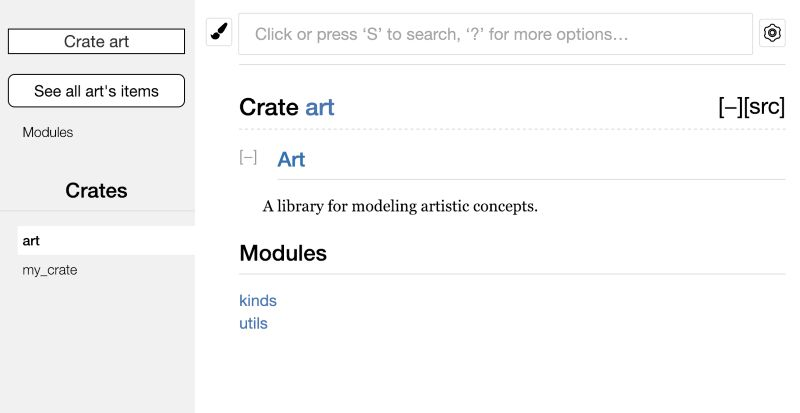
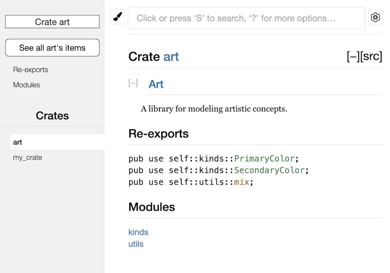

# Cargo 和 `Crates.io`

- 在 Rust 中,Cargo 是官方的包管理器和构建工具.它使得管理 Rust 项目变得非常简单,包括依赖管理、构建、测试和发布等功能.
- `Crates.io` 是 Rust 的官方包注册中心,开发者可以在这里发布和分享他们的 Rust 库(称为 "crate").

## 采用发布配置自定义构建

**发布配置(release profiles)** 是预定义且可定制的配置文件集,它们包含不同的配置,允许程序员更灵活地控制代码编译的多种选项.每一种配置都独立于其他配置

发布配置(Release Profiles) 就是给 Rust 编译器准备的几套"预设方案".

你可以把它想象成手机上的"省电模式"、"性能模式"和"拍照模式":

### 它是做什么的？

编译器在把你的代码变成 `.exe` 时,有很多开关可以拨动(比如: 要不要检查越界？要不要把代码压缩得更小？运行速度要多快？).

发布配置就是把这些开关打包成几个固定的"套餐".

### 两个最常用的"官方套餐"

Rust 默认给你准备了两个最基础的配置:

- `dev` 配置(运行 `cargo build` 时用):
  - 目标: 让你写代码、调 Bug 最爽.
  - 特点: 编译飞快,包含大量调试信息,但运行起来可能有点慢.
- `release` 配置(运行 `cargo build --release` 时用):
  - 目标: 让程序给用户用的时候最快.
  - 特点: 编译器会花很长时间去拼命优化代码,删掉没用的调试信息.编译很慢,但运行速度极快.

### "可定制"是什么意思？

如果你觉得官方的"套餐"不合口味,你可以自己在 Cargo.toml 里改.

比如,你想在开发模式下也让代码运行得快一点,你可以这样写:

```toml
[profile.dev]
opt-level = 1 # 默认是 0(不优化),改写成 1 表示稍微优化一下

[profile.release]
opt-level = 3 # 默认是 3(最高优化),你也可以改成 2 或者 0,甚至 -1(不优化)！
```

### 独立于其他配置

意思是你改了 dev 的设置,完全不会影响到 release.它们是两套互不干扰的脚本.

### 总结成一句话

"发布配置就是给编译器下的‘指令集’,让你能一键切换‘快速开发’(省时间)或‘追求性能’(省空间/提速)两种状态."

## 将 crate 发布到 `Crates.io`

### 优化文档

- crate 是 Rust 中的一个包(库或二进制),它可以被其他项目依赖和使用.

1. 在 crate 中需要编写文档注释来描述 crate 的功能和用法,在 [编写自动化测试](16.编写自动化测试.md#文档测试)中我们已经介绍过文档测试了.
2. 为了让文档能更好的展示内部模块的层级,可以使用 `pub use` 语句重导出
   - 重导出后,用户在使用时就不需要关心模块的层级结构了,可以直接通过 `use crate_name::function_name` 来使用函数,而不需要知道它是在哪个模块中的.
   - 在文档中,重导出也会让函数直接显示在 crate 的根目录下,用户可以更方便地找到和使用它们.
     
     

### 发布 crate

1.  注册一个 [Crates.io](https://crates.io/) 账号并获取 API token.

    ```bash
    # 使用 API token 登录 Cargo
    $ cargo login
    abcdefghijklmnopqrstuvwxyz012345
    ```

    > 这个命令会把你的 API token 告诉 Cargo,并将其保存在本地的 ~/.cargo/credentials 文件中

2.  在 `Cargo.toml` 中填写 crate 的元数据(如名称、版本、描述等).

    ```toml
    [package]
    name = "guessing_game"  # crate 的名称,必须唯一
    version = "0.1.0" # 版本号,遵循语义化版本规范
    edition = "2024" # Rust 版本,建议使用最新的稳定版本
    description = "A simple guessing game crate" # crate 的简短描述
    authors = ["Your Name <your.email@example.com>"] # 作者信息
    license = "MIT" # 许可证类型,建议使用开源许可证
    ```

3.  发布到 `Crates.io`.

    ```bash
    $ cargo publish
    ```

    > 这个命令会编译你的 crate,检查是否符合发布要求(如版本号唯一、依赖项正确等),然后将其上传到 `Crates.io`.
    >
    > 发布 crate 时务必小心,因为发布是永久性的.对应版本无法被覆盖,其代码也无法被删除.`Crates.io` 的一个主要目标,是充当代码的永久归档服务器,这样所有依赖 `Crates.io` 上 crate 的项目都能一直正常工作.而如果允许删除版本,就无法实现这一目标.不过,可发布的版本号数量并没有限制.

4.  使用 cargo yank 从 Crates.io 撤回版本

    ```bash
    $ cargo yank --vers 0.1.0
    ```

    > 撤回不会删除任何代码
    >
    > 这个命令会标记指定版本为"yanked",撤回某个版本会阻止新项目依赖这个版本,不过所有已经依赖它的项目仍然可以下载并继续依赖它.从本质上说,撤回意味着: 所有已有 Cargo.lock 的项目都不会因此损坏,而任何新生成的 Cargo.lock 都不会再使用被撤回的版本

## Cargo 工作空间

### 创建工作空间

- 下面示例了一个完整的创建多包工作空间的过程,包含一个二进制包 `adder` 和一个库包 `add_one`,其中 `adder` 依赖 `add_one`.
- 通过不同的命令展示了如何构建和运行工作空间中的不同包,以及整个工作空间.

1.  创建文件夹并进入:

    ```bash
    $ mkdir add # 创建一个新的目录来存放工作空间
    $ cd add # 进入目录
    ```

2.  在文件夹中创建 `Cargo.toml` 文件并添加以下内容:

    ```toml
    [workspace]
    resolver = "3"
    ```

    > 这个文件不会有 `[package]` 部分,而是会以 `[workspace]` 部分开头,这样我们就能向工作空间添加成员.我们还会把 resolver 的值设为 "3",以便在工作空间中使用 Cargo 最新的依赖解析算法

3.  在 add 目录运行 `cargo new` 新建 `adder` 二进制 crate

    ```bash
    $ cargo new adder
    ```

    > 在工作空间中运行 `cargo new` 时,新创建的包也会被自动加入工作空间 `Cargo.toml` 中 `[workspace]` 定义的 `members` 键,像这样:

    ```toml
    [workspace]
    resolver = "3"
    members = ["adder"]
    ```

4.  运行 `cargo build` 来构建工作空间,你的 add 目录中的文件应如下所示:

    ```bash
    ├── Cargo.lock
    ├── Cargo.toml
    ├── adder
    │   ├── Cargo.toml
    │   └── src
    │       └── main.rs
    └── target
    ```

5.  在工作空间中创建另一个名为 `add_one` 的库 crate

    ```bash
    $ cargo new add_one --lib
    ```

    > 现在顶层的 `Cargo.toml` 的 `members` 列表将会包含 `add_one` 路径:

    ```toml
    [workspace]
    resolver = "3"
    members = ["adder","add_one"]
    ```

    > 现在 `add` 目录应该有如下目录和文件

    ```bash
    ├── Cargo.lock
    ├── Cargo.toml
    ├── add_one
    │   ├── Cargo.toml
    │   └── src
    │       └── lib.rs
    ├── adder
    │   ├── Cargo.toml
    │   └── src
    │       └── main.rs
    └── target
    ```

6.  在 `add_one/src/lib.rs` 文件中,增加一个 `add_one` 函数

    ```rust
    pub fn add_one(x: i32) -> i32 {
        x + 1
    }
    ```

7.  让二进制包 `adder` 依赖包含库的 `add_one` 包

    ```toml
    [dependencies]
    add_one = { path = "../add_one" }
    ```

    > Cargo 并不会假定工作空间中的 crate 会彼此依赖,因此我们需要显式声明这些依赖关系

8.  在 `adder/src/main.rs` 中使用 `add_one` 函数

    ```rust
    use add_one::add_one;

    fn main() {
        let num = 5;
        let result = add_one(num);
        println!("{} + 1 = {}", num, result);
    }
    ```

9.  运行 `cargo run -p adder` 来运行 `adder` 包

    ```bash
    $ cargo run -p adder
    ```

    > 通过 -p 参数加上包名,指定要运行工作空间中的哪个包

10. 运行 `cargo test -p add_one` 来测试 `add_one` 包

    ```bash
    $ cargo test -p add_one
    ```

11. 运行 `cargo build -p add_one` 来构建 `add_one` 包

    ```bash
    $ cargo build -p add_one
    ```

12. 运行 `cargo build` 来构建整个工作空间

    ```bash
    $ cargo build
    ```

    > 运行 `cargo build` 会构建工作空间中的所有包

### 依赖外部crate

主要是解决工作空间中多个 `crate` 依赖同一个外部 `crate` 时,如何确保它们使用的是同一个版本的问题.

- 工作空间只在顶层有一个 `Cargo.lock` 文件,而不是让每个 `crate` 目录里都各自有一个 `Cargo.lock`.这能确保所有 `crate` 使用的都是同一个版本的依赖,避免了版本冲突的问题.
- 如果我们把 `rand` 包同时加到 `adder/Cargo.toml` 和 `add_one/Cargo.toml` 中,Cargo 会把它们都解析为同一个 `rand` 版本,并把结果记录到唯一的 `Cargo.lock` 中.

## 使用 `cargo install` 安装二进制文件

- `cargo install` 命令用于安装 Rust 的二进制工具(crate),它会从 `Crates.io` 上下载并编译指定的 `crate`,然后将生成的可执行文件放到系统的 PATH 中,方便用户在命令行中直接使用.

```bash
cargo install crate_name
```

## Cargo 自定义扩展命令

- `Cargo` 的设计允许你用新的子命令来扩展它,而不必修改 `Cargo` 本身.
- 如果你的 `$PATH` 中有一个名为 `cargo-something` 的二进制文件,那么你就可以像运行 `Cargo` 子命令一样,通过 `cargo something` 来运行它.
- 这类自定义命令也会在你运行 `cargo --list` 时显示出来.
- `Cargo` 这种设计带来了一个非常方便的好处: 你可以用 `cargo install` 安装扩展,然后像使用 `Cargo` 内建工具一样运行它们.
