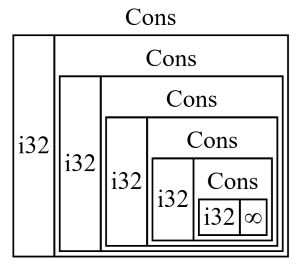
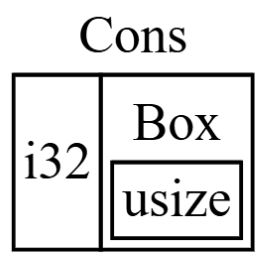

# 智能指针

## 介绍

- **指针**(pointer)是一个包含内存地址的变量的通用概念,这个地址会引用,或者说 "指向"(points at)一些其它数据
- **智能指针**(smart pointers)是一类数据结构,它们的行为类似指针,但还拥有额外的元数据和功能

> 本质上: 智能指针是一个结构体,包含一个指向数据的内存地址,并且实现了 `Deref` 和 `Drop` 这两个 Trait,使得它们既能像普通引用一样使用,又能在离开作用域时自动清理资源.
>
> 智能指针不同于普通结构体的地方在于它实现了 `Deref  trait` 和 `Drop trait`

### 智能指针与普通引用的区别

| 特性     | 普通引用 (&T)    | 智能指针 (如 Box, Rc)                |
| -------- | ---------------- | ------------------------------------ |
| 本质     | 只是一个内存地址 | 包含地址 + 额外元数据的结构体        |
| 所有权   | 借用(不持有数据) | 拥有(或共同拥有)数据                 |
| 自动清理 | 不负责清理数据   | 离开作用域时自动释放内存             |
| 额外能力 | 无               | 可以跨线程、引用计数、修改只读数据等 |

### 为什么叫"智能"？

因为它们实现了两个关键的 Trait:

- `Deref`: 让结构体能够返回引用,能像用普通引用一样用它(比如 `*my_box`).
- `Drop`: 定义了它"死"的时候该如何清理现场.

### Rust 中常见的智能指针

- `String` 和 `Vec<T>`: 没错,它们其实也是智能指针！因为它们管理着一块动态增长的内存,并且在离开作用域时会自动清理.
- `Box<T>`: 最简单的.把数据存到堆(Heap)上,而不是栈上.
- `Rc<T>`: 引用计数.允许多个"主人"共享同一块数据.当最后一个主人也走了,数据才会被销毁.
- `RefCell<T>`: 内部可变性.即使外部是不可变的,也允许在运行时修改数据.它通过在运行时检查借用规则来实现这一点.

## `Deref` Trait 返回引用

- 本质是返回一个**引用**的一个**方法**
- 实现 `Deref trait` 允许你自定义**解引用运算符**(dereference operator)`*` 的行为(不要把它和乘法运算符或通配符运算符混淆)
- 通过以某种方式实现 Deref,使智能指针能够像常规引用一样被对待,你就可以编写操作引用的代码,并同样把它用于智能指针.

### `Deref` Trait 的定义

```rust
use std::ops::Deref;
struct MyBox<T>(T);
impl<T> MyBox<T> {
    fn new(x: T) -> MyBox<T> {
        MyBox(x)
    }
}
impl<T> Deref for MyBox<T> {
    type Target = T; // 关联类型,用于限制一个 struct 只能为一种类型实现这个 trait
    fn deref(&self) -> &T {
        &self.0 // 元组结构体的第一个字段 T 的引用
    }
}

fn main() {
    let x = 5;
    let y = MyBox::new(x); // 转移所有权到 MyBox 中

    assert_eq!(5, x); // x 是一个 i32 类型的值, 实现了 Copy trait
    assert_eq!(5, *y); // 实现了Deref trait,才可以通过解引用运算符 * 来获取 MyBox 中的值,实际上是执行的 *(y.deref())
}
```

> `*y` 在这里是一个**语法糖**,编译器会自动将其转换为 `*(y.deref())`,而 `y.deref()` 返回一个 `&i32` 类型的引用,所以最终得到的是 `*(&i32)` 也就是 `i32` 的值.

### `Deref` 隐式转换

**Deref 隐式转换**(Deref coercions)或者叫解引用强制多态,是 Rust 的一个便利功能,它在编译时自动将**引用**从一种类型转换为另一种类型,前提是目标类型实现了 `Deref trait`.这使得在函数和方法调用中使用智能指针变得非常方便,因为它们会自动被转换为常规引用.

```rust
use std::ops::Deref;
struct MyBox<T>(T);
impl<T> MyBox<T> {
    fn new(x: T) -> MyBox<T> {
        MyBox(x)
    }
}
impl<T> Deref for MyBox<T> {
    type Target = T; // 关联类型,用于限制一个 struct 只能为一种类型实现这个 trait
    fn deref(&self) -> &T {
        &self.0 // 元组结构体的第一个字段 T 的引用
    }
}

fn hello(name: &str) {
    println!("Hello, {name}!");
}

fn main() {
    let m = MyBox::new(String::from("Rust")); // 转移所有权到 MyBox 中
    hello(&m); // 这里发生了 Deref 隐式转换,&MyBox<String> 自动转换为 &String
               // 进一步,&String 自动转换为 &str,因为 String 实现了 Deref<Target=str>
}
```

**解释**

1. `hello` 函数需要一个 `&str` 类型的参数.
2. `m` 是一个 `MyBox<String>` 类型的智能指针.
3. 当我们传递 `&m` 给 `hello` 时,编译器发现类型不匹配,于是发生了 **Deref 隐式转换**:
   - `&m` 调用 `m.deref()` 方法, 将 `MyBox<String>` 转换为 `&String`,因为 `MyBox` 实现了 `Deref<Target=String>`
   - 发现还是不匹配,继续执行 `m.deref().deref()` 将 `&String` 转换为 `&str`,因为 `String` 实现了 `Deref<Target=str>`.

   ```rust
   // 标准库中的简化代码
   impl Deref for String {
       type Target = str; // 目标是 str
       fn deref(&self) -> &str {
           // 返回指向内部字符串切片的指针
       }
   }
   ```

> `&` 就像是一个"开启搜索"的信号,它告诉编译器: "如果类型不对,去看看它有没有实现 `Deref` 接口,帮我转成正确的引用类型."

- `*m`(手动解引用): 会触发 `deref()` 得到 `&String`,然后由于 `*` 运算符的存在,再尝试转换成 `String`.
- `&m`(隐式转换): 是编译器在传参时的"变身术",它发现你需要 `&String`,就偷偷帮你调了 `deref()`,直接拿走返回的那个 `&String` 用.

**疑问**

1. 为什么 `&MyBox<String>` 转为 `&String` 不是 `&&String`？
   - 不是简单的"数学加法",而是一种类型的改写.
   - `&MyBox<String>` 是一个引用,编译器会检查 `MyBox` 是否实现了 `Deref`,如果实现了,就会调用 `deref()` 方法返回一个 `&String` 替换原来的引用,而不是再加一个 `&`.

> 转换过程实质上是:
>
> 编译器在编译时发现类型不匹配,它会自动搜索链路上的 `Deref` 实现.只要能通过调用 `.deref()` 得到目标类型,它就会自动、多次地插入这些调用,直到类型对上为止.

## `Drop` Trait 清理逻辑

- 当值离开作用域时,Rust 会自动调用该值的 `drop` 方法,用于释放资源(如文件句柄、网络连接等).
- 通过实现 `Drop` trait,你可以自定义清理逻辑.
- **禁止**显式调用 `.drop()` 方法(会导致二次释放),但可以使用 **`std::mem::drop(value)`** 函数提前手动释放.

```rust
struct CustomPointer {
    data: String,
}

impl Drop for CustomPointer {
    fn drop(&mut self) {
        println!("清理 CustomPointer,data = {}", self.data);
    }
}

fn main() {
    let c = CustomPointer { data: String::from("重要资源") };
    let d = CustomPointer { data: String::from("另一个资源") };
    println!("创建完毕");

    // 提前手动释放 c(而不是调用 c.drop())
    drop(c);
    println!("c 已被提前释放");
} // d 在这里自动被释放,打印清理信息
```

> 变量的释放顺序与创建顺序相反(后进先出,类似栈).

- `std::mem::drop(s)` 的实现其实是一个空函数

```rust
pub fn drop<T>(_x: T) {} // 仅仅是为了拿走所有权,利用作用域规则触发清理
```

## `Box<T>` 指向堆上数据

- `Box<T>` 允许你将数据存储在堆上而不是栈上.
- 留在栈上的则是指向堆数据的指针.

### 使用场景

- 当有一个在编译时未知大小的类型,而又想要在需要确切大小的上下文中使用这个类型值的时候
- 当有大量数据并希望在确保数据不被拷贝的情况下转移所有权的时候
- 当希望拥有一个值并只关心它的类型是否实现了特定 trait 而不是其具体类型的时候

### 基本用法

- `Box::new(value)` 创建一个新的 `Box<T>` 智能指针,将 `value` 存储在堆上.

使用 box 在堆上存储一个 i32 值

```rust
fn main() {
    let b = Box::new(5);
    println!("b = {b}");
}
```

### Box 允许创建递归类型

- **递归类型**(recursive type)的值可以拥有另一个同类型的值作为其自身的一部分.

```rust
enum List {
    Cons(i32, List),
    Nil,
}

// --snip--

use crate::List::{Cons, Nil};
fn main() {

    // ❌ 报错recursive type `List` has infinite size
    let list = Cons(1, Cons(2, Cons(3, Nil)));

    // ✅ 使用 Box 来打包递归类型,让编译器知道它的大小是有限的
    let list = Cons(1, Box::new(Cons(2, Box::new(Cons(3, Box::new(Nil))))));
}

```

使用 Box 之后,编译器知道 `Cons` 变体中的 `Box<List>` 是一个指针,指向堆上的另一个 `List` 值,而不是直接包含另一个 `List` 值,指针的数据大小是固定的,从而解决了递归类型无限大的问题.

 

## `Rc<T>` 引用计数智能指针

- `Rc<T>`(Reference Counted)允许同一数据拥有**多个所有者**.
- 通过引用计数,跟踪有多少个引用指向同一数据,当计数降为 0 时,数据才会被释放.
- **只适用于单线程**.多线程场景请使用 `Arc<T>`(原子引用计数).

### 使用场景

当你希望在程序的多个部分共享数据,但在编译期无法确定哪一部分最后使用这个数据时使用.

### 基本用法

- `Rc::new(value)` 创建一个新的 `Rc<T>` 智能指针.
- `Rc::clone(&rc)` 增加引用计数,而不是进行深拷贝.
- `Rc::strong_count(&rc)` 获取当前的强引用计数.

```rust
use std::rc::Rc;

fn main() {
    let a = Rc::new(String::from("共享数据"));
    println!("创建 a 后,引用计数 = {}", Rc::strong_count(&a)); // 1

    let b = Rc::clone(&a); // 不是深拷贝！只是增加引用计数
    println!("克隆给 b 后,引用计数 = {}", Rc::strong_count(&a)); // 2

    {
        let c = Rc::clone(&a);
        println!("克隆给 c 后,引用计数 = {}", Rc::strong_count(&a)); // 3
    } // c 在这里离开作用域,计数减 1

    println!("c 离开作用域后,引用计数 = {}", Rc::strong_count(&a)); // 2
} // b 和 a 在这里离开作用域,计数降为 0,数据被释放
```

> `Rc::clone(&a)` 和 `a.clone()` 的区别: 前者是约定俗成,提醒读者"这只是增加引用计数,代价极低",而不是深拷贝.

### `Rc<T>` 只允许不可变借用

`Rc<T>` 本身只允许不可变地(`&T`)访问数据,无法获得可变引用.如果需要修改,需配合 `RefCell<T>` 使用(见下节).

## `RefCell<T>` 与内部可变性模式

- **内部可变性(Interior mutability)** 是 Rust 的一个设计模式,允许你在**持有不可变引用**的情况下,依然能够修改数据.
- `RefCell<T>`就是实现内部可变性的智能指针,它能修改不可变引用的数据
- `RefCell<T>` 将借用规则检查从**编译期**推迟到**运行时**,如果运行时违反借用规则(同时存在多个可变借用),程序会 `panic`.

> 与 `Box<T>` 的区别: `Box<T>` 在编译期强制借用规则;`RefCell<T>` 在运行时强制借用规则,适合编译器无法推断但程序员确信代码正确的场景.

### 使用场景

- 当你需要在编译时无法确定借用关系,但确信在运行时不会违反借用规则时使用.
- 当你需要在不可变上下文中修改数据时使用(如在 `Rc<T>` 中修改共享数据).

### 基本用法

- `RefCell::new(value)`: 创建 `RefCell<T>` 智能指针.
- `RefCell<T>` 提供了两个主要方法来访问内部数据:
  1. `borrow()` → 返回 `Ref<T>`(不可变借用,可同时存在多个)
  2. `borrow_mut()` → 返回 `RefMut<T>`(可变借用,同一时刻只能有一个,且与不可变借用互斥)

```rust
use std::cell::RefCell;

fn main() {
    let data = RefCell::new(vec![1, 2, 3]);

    // 不可变借用
    println!("当前数据: {:?}", data.borrow());

    // 可变借用: 修改内部数据
    data.borrow_mut().push(4);

    println!("修改后: {:?}", data.borrow()); // [1, 2, 3, 4]
}
```

### `Rc<T>` + `RefCell<T>` 组合: 多所有者 + 可变

这两者常常配合使用,实现"多个所有者共享同一块可变数据":

```rust
use std::rc::Rc;
use std::cell::RefCell;

fn main() {
    let shared = Rc::new(RefCell::new(0));

    let a = Rc::clone(&shared);
    let b = Rc::clone(&shared);

    *a.borrow_mut() += 10;
    *b.borrow_mut() += 20;

    println!("最终值: {}", shared.borrow()); // 30
}
```

## 引用循环会导致内存泄漏

- 当两个 `Rc<T>` 互相持有对方的引用时,会形成**引用循环**(reference cycle),导致引用计数永远无法降为 0,内存永远不会被释放,造成内存泄漏.

```rust
use std::rc::Rc;
use std::cell::RefCell;

struct Node {
    next: RefCell<Option<Rc<Node>>>,
}

fn main() {
    // 1. 创建节点 a
    let a: Rc<Node> = Rc::new(Node { next: RefCell::new(None) });
    // 2. 创建节点 b,并让 b 指向 a
    let b: Rc<Node> = Rc::new(Node { next: RefCell::new(Some(Rc::clone(&a))) });

    // 3. 让 a 指向 b —— 此时形成了闭环:a -> b -> a
    *a.next.borrow_mut() = Some(Rc::clone(&b));

    // 此时 a 和 b 的强引用计数都是 2
    // 当 main 函数结束时,a 和 b 的变量被销毁,计数减 1,但仍各剩 1
    // 内存永远不会被回收,发生了内存泄漏！
}
```

### 使用 `Weak<T>` 解决引用循环

- `Weak<T>` 是一种**弱引用**,不增加 `strong_count`,只增加 `weak_count`.
- 与 `Rc<T>`(强引用)最大的区别在于:`Weak<T>` 不持有所有权,也不会增加强引用计数,因此不会阻止数据被释放.
- 当所有强引用(`Rc`)消失时,数据会被释放,`Weak<T>` 会自动失效.

**基本用法**

- `Weak::new()` 创建一个空的 `Weak<T>` 指针.
- `Rc::downgrade(&rc)` 创建一个 `Weak<T>` 指向 `Rc<T>`,但不增加强引用计数.
- `weak.upgrade()` 尝试获取一个 `Rc<T>`,如果原数据仍然存在(强引用计数 > 0),返回 `Some(Rc<T>)`;如果数据已被释放(强引用计数 = 0),返回 `None`.

```rust
use std::rc::{Rc, Weak};
use std::cell::RefCell;

struct Node {
    // 将此处改为 Weak 以打破循环
    next: RefCell<Option<Weak<Node>>>,
}

fn main() {
    // 1. 创建节点 a
    let a = Rc::new(Node { next: RefCell::new(None) });

    // 2. 创建节点 b,并让 b 指向 a
    // 注意:这里 b -> a 使用了 downgrade 将 Rc 转为 Weak
    let b = Rc::new(Node {next: RefCell::new(Some(Rc::downgrade(&a)))});

    // 3. 让 a 指向 b
    // a -> b 保持强引用,b -> a 是弱引用,不再形成闭环
    *a.next.borrow_mut() = Some(Rc::downgrade(&b));

    // 验证引用计数:
    // a 的强引用计数为 1（变量 a）,弱引用计数为 1（b.next）
    // b 的强引用计数为 1（变量 b）,弱引用计数为 1（a.next）
    println!("a strong count: {}", Rc::strong_count(&a)); // 1

    // 当 main 结束,a 和 b 的强引用计数归零,内存将被正常回收.
}
```

### `Rc` / `Weak` 引用计数对比

| 类型      | 增加计数类型     | 数据是否存活 | 访问方式                     |
| --------- | ---------------- | ------------ | ---------------------------- |
| `Rc<T>`   | `strong_count` ↑ | 保持数据存活 | 直接解引用                   |
| `Weak<T>` | `weak_count` ↑   | 不保证存活   | 必须先 `.upgrade()` 才能访问 |

## `Arc<T>` 原子引用计数(多线程版 `Rc`)

- `Arc<T>`(Atomic Reference Counted)是 `Rc<T>` 的**线程安全**版本.
- 使用原子操作修改引用计数,有轻微性能开销,但保证多线程安全.
- 单独使用 `Arc<T>` 只能共享**不可变**数据;修改数据需搭配 `Mutex<T>` 或 `RwLock<T>`.

```rust
use std::sync::{Arc, Mutex};
use std::thread;

fn main() {
    let counter = Arc::new(Mutex::new(0));
    let mut handles = vec![];

    for _ in 0..5 {
        let counter = Arc::clone(&counter); // 克隆 Arc(增加引用计数)
        let handle = thread::spawn(move || {
            *counter.lock().unwrap() += 1;  // Mutex 保证互斥访问
        });
        handles.push(handle);
    }

    for handle in handles {
        handle.join().unwrap();
    }
    println!("最终计数: {}", *counter.lock().unwrap()); // 5
}
```

**选择指南**

| 场景                 | 选择                     |
| -------------------- | ------------------------ |
| 单线程共享不可变数据 | `Rc<T>`                  |
| 单线程共享可变数据   | `Rc<RefCell<T>>`         |
| 多线程共享不可变数据 | `Arc<T>`                 |
| 多线程共享可变数据   | `Arc<Mutex<T>>`          |
| 多线程多读少写       | `Arc<RwLock<T>>`(读写锁) |

## `Cell<T>` 简单内部可变(Copy 类型专用)

- `Cell<T>` 是比 `RefCell<T>` 更轻量的内部可变性工具.
- **仅适用于实现了 `Copy` 的类型**(如 `i32`、`bool`).
- 通过 `.get()` 和 `.set()` 读写,无需引用和借用检查,**没有运行时开销**.

```rust
use std::cell::Cell;

fn main() {
    let x = Cell::new(5);
    println!("{}", x.get()); // 5
    x.set(10);               // 直接设置,无需 borrow_mut
    println!("{}", x.get()); // 10
}
```

| 特性       | `Cell<T>`           | `RefCell<T>`                           |
| ---------- | ------------------- | -------------------------------------- |
| 适用类型   | 仅 `Copy` 类型      | 任意类型                               |
| 访问方式   | `.get()` / `.set()` | `.borrow()` / `.borrow_mut()` 返回引用 |
| 运行时开销 | 无                  | 有(借用计数检查)                       |
| 线程安全   | 否                  | 否                                     |
