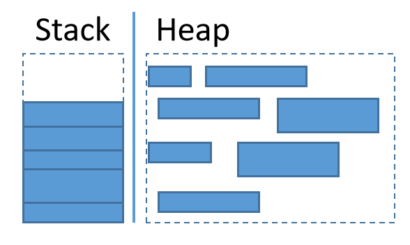
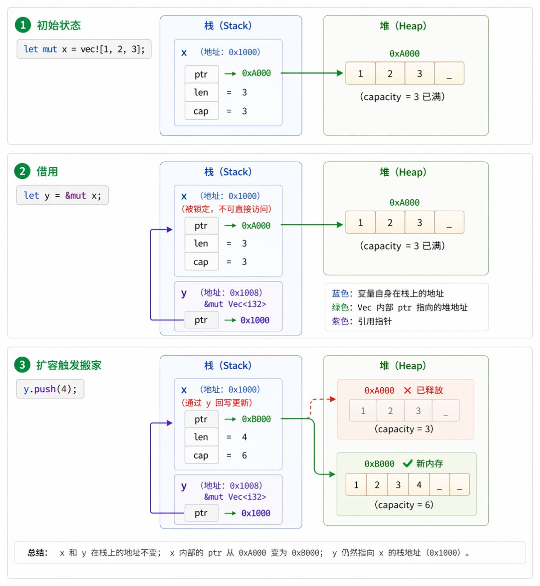

# 内存和指针

内存和指针是理解 Rust 所有权系统的核心基础概念.Rust 通过所有权、借用和生命周期等机制来管理内存,确保安全性和性能.理解内存布局和指针的底层实现对于深入理解 Rust 的设计理念非常重要.

## 数据单位

- `bit`(位): 是计算机中最小的数据单位,一个 bit 只能存储 0 或 1,也叫做二进制位.
- `byte`(字节): 是计算机中最基本的数据存储单位,由 8 个 bit 组成,可以存储 256(2⁸)种不同的值.在 Rust 中,一个 `u8` 就是一个 byte,占用 8 bit 的内存空间.

> [!tip] 单位换算: 1 byte = 8 bit

## 内存基础

- **内存**: 计算机中用于存储数据的物理设备,分为**栈**和**堆**两种类型.
- **栈(Stack)**: 用于存储局部变量和函数调用信息,访问速度快,但大小有限.
- **堆(Heap)**: 用于存储动态分配的数据,大小灵活,但访问速度较慢.

栈和堆简化示意图:



### 内存的本质

内存可以看成一段按字节(8 bit)编号的连续空间:

```
地址: 0x1000  0x1001  0x1002 ...
数据: 01      FF      0A
```

**内存地址**是一个数字,表示内存中的一个位置.**每个地址对应一个字节**,这个字节空间可以存储一个数值或数据的一部分.指针就是用来存储这些地址的变量.

### 寻址能力

内存中每个地址对应一个字节:

- **32 位系统**: 最多能够产生 2³² 个地址,管理 2³² 字节 ≈ 4 GB 内存
- **64 位系统**: 理论寻址空间达 2⁶⁴ 个地址 ≈ 18 EB(足够未来使用)

  > 理论上在 32 位系统上使用大于 4 GB 的内存条是没有意义的,因为寻址能力限制了只能访问 4 GB 的内存(实际上通过分页机制可以访问更多).

### usize 和 isize

`usize` 和 `isize` 是 Rust 中的整数类型,是"变色龙"类型,它们的大小取决于目标平台的指针大小:

| 平台位宽  | usize 类型 | isize 类型 | 字节数 |
| --------- | ---------- | ---------- | ------ |
| 32 位机器 | u32        | i32        | 4      |
| 64 位机器 | u64        | i64        | 8      |

**设计原因**: `usize` 用于数组索引和指针偏移.指针大小取决于寻址能力,索引类型也必须同步.若 64 位系统用 `u32` 做下标,无法访问 4 GB 以外的数据.

### 栈的特性

栈以放入值的顺序存储值并以相反顺序取出值,这也被称作 **后进先出(LIFO,last in, first out)**.想象一下一叠盘子: 当增加更多盘子时,把它们放在盘子堆的顶部,当需要盘子时,也从顶部拿走.

- **入栈(pushing)**: 增加数据到栈顶
- **出栈(popping)**: 从栈顶移出数据
- **限制**: 栈中的所有数据都必须占用已知且固定的大小
- **特点**: 不能从中间也不能从底部增加或拿走数据

**存储在栈上的数据类型**:

| 数据类型           | 示例                              | 说明                 |
| ------------------ | --------------------------------- | -------------------- |
| 基本标量类型       | `i32`、`f64`、`bool`、`char`      | 基本类型             |
| 数组               | `[i32; 10]`、`[f64; 5]`           | 所有元素大小固定     |
| 元组               | `(i32, f64)`、`(char, bool, i8)`  | 所有元素大小固定     |
| 结构体             | `struct Point { x: i32, y: i32 }` | 所有字段都是基本类型 |
| 枚举               | `enum Option<T>`                  | 大小固定的枚举       |
| 引用和指针本身     | `&i32`、`*const u8`               | 只存储地址,8 字节    |
| 局部变量和函数参数 | -                                 | -                    |

> 值类型(Copy 语义)通常在栈上

### 堆的特性

堆是缺乏组织的动态内存区域.当向堆放入数据时:

1. 要请求一定大小的空间
2. 内存分配器(memory allocator)在堆的某处找到一块足够大的空位
3. 把它标记为已使用,并返回一个表示该位置地址的 **指针(pointer)**
4. 这个过程称作 **在堆上分配内存(allocating on the heap)**

**存储在堆上的数据类型**:

| 数据类型       | 说明                                                           |
| -------------- | -------------------------------------------------------------- |
| 集合类型的元素 | `Vec<T>` 的元素、`String` 的字节数据、`HashMap<K, V>` 的键值对 |
| 堆分配对象     | `Box<T>` 指向的数据存在堆上                                    |
| 特征对象       | `&dyn Trait` 实际指向的数据存在堆上                            |

> - 引用/所有权类型及其元数据在栈上,但数据内容通常在堆上
> - 容器类型的 header(长度、容量、指针)在栈上,数据在堆上

### 性能对比

| 操作维度       | 栈                                          | 堆                                             |
| -------------- | ------------------------------------------- | ---------------------------------------------- |
| **分配速度**   | 快速,分配器无需搜索内存空间；位置总是在栈顶 | 较慢,分配器必须首先找到足够的内存空间,并做记录 |
| **访问速度**   | 快速,直接访问                               | 慢速,必须通过指针间接访问                      |
| **内存局部性** | 优秀,数据彼此接近                           | 较差,可能分散各处                              |
| **大小要求**   | 编译时必须已知且固定                        | 运行时可以动态变化                             |

## 指针基础

### 指针和变量

- **指针**本身是一个变量,用于存储内存地址.
- **变量**是一段连续内存空间起始地址的别名,这个空间可以存储数据值或指针地址.

用一个简化的例子来说明:

```rust
let a: i32 = 1;
```

当你写下这段代码,Rust 在栈上开辟了一块大小为 4 字节的内存空间(因为 `i32` 占用 4 字节),并将值 `1` 存储在这块内存中:

```
地址: 0xA001  0xA002  0xA003  0xA004
数据: 01      00      00      00
```

- 这块 4 字节内存的起始地址 `0xA001` 和变量 `a` 绑定在一起,你也可以说 `a` 是这个地址的别名.
- 这块 4 字节内存存储了数据 1
- 当使用变量时,Rust 会根据变量名 `a` 找到对应的内存地址 `0xA001`,然后根据数据类型(`i32`)知道要读取 4 字节的数据(往后取 4 字节)来获取值 `1`
- 此时还没有涉及指针

```rust
let a: i32 = 1;
let b: &i32 = &a; // [!code ++] 获取 a 的引用
```

当你创建变量 `b` 时, `&a` 代表获取 `a` 的引用,也就是获取 `a` 的内存地址 `0xA001`.因此,Rust 会在栈上开辟一块内存([64 位是 8 字节大小的空间](#架构决定指针大小))来存储这个地址 `0xA001`:

```
地址: 0xB001  0xB002  0xB003  0xB004  0xB005  0xB006  0xB007  0xB008
数据: 01      A0      00      00      00      00      00      00
```

> 以小端序(低位字节在低地址)存储地址值 `0xA001`,64 位指针共占 8 字节,高位补零.

- 这块 8 字节内存的起始地址 `0xB001` 和变量 `b` 绑定在一起.
- 这块 8 字节内存存储了 `a` 的地址 `0xA001`

此时我们说 `b` 是一个指针,存储了 `a` 的地址.通过 `b`,我们可以访问 `a` 的值:

```rust
let a: i32 = 1;
let b: &i32 = &a;
println!("a: {}, b: {}", a, *b); // [!code ++] 输出: a: 1, b: 1
```

> **解释**: `*b` 是解引用操作,告诉 Rust 通过 `b` 存储的地址 `0xA001` 去访问内存中的值 1.

### 架构决定指针大小

- 指针本身是一个变量,用于存储内存地址.
- 指针的宽度(大小)总是与 CPU 的寻址能力(即 usize 类型的大小)一致:

| 架构                         | 指针大小 | 位数    | 寻址能力       |
| ---------------------------- | -------- | ------- | -------------- |
| 64 位(x86_64, Apple Silicon) | 8 字节   | 64 bits | 2⁶⁴ 个内存地址 |
| 32 位(WASM, 老式 ARM)        | 4 字节   | 32 bits | 2³² 个内存地址 |
| 16 位(某些嵌入式设备)        | 2 字节   | 16 bits | 2¹⁶ 个内存地址 |

> **说明**: 这解释了为什么变量 `b` 开辟了 8 字节的内存,因为在 64 位系统上指针大小就是 8 字节.

### 瘦指针与胖指针

Rust 中有两种主要指针形态:

**普通指针(瘦指针Thin Pointer)**

- **栈占用**: 8 字节
- **存储内容**: 仅起始地址
- **大小确定**: 根据编译时类型确定,不携带额外元数据
- **典型代表**: `&i32`、`Box<i64>`、`*mut u8`

> **注意**: 上文中例子中的 `b` 就是一个普通指针,也叫瘦指针,它只存储了 `a` 的地址 `0xA001`,没有其他元数据.

**胖指针(Fat Pointer)**

- **栈占用**: 16 字节(2 个 `usize`)
- **存储内容**: 起始地址 + 额外元数据,根据指向的类型不同分为两种:
  - **切片引用**(`&[T]`、`&str`): 起始地址 + 长度(元素个数),总字节数 = 长度 × `size_of::<T>()`
  - **特征对象**(`&dyn Trait`): 数据起始地址 + vtable 指针(vtable 中包含方法表、类型尺寸和对齐信息)
- **典型代表**: `&[u8]`、`&str`、`&dyn Debug`

**句柄 / 超胖指针**

一般称为 `Handle`(句柄)

- **栈占用**: 24 字节(3 个 `usize`)
- **存储内容**: 起始地址 + 长度 + 容量
- **典型代表**: `Vec<T>`、`String`
- **说明**: `Vec<T>` 和 `String` 在栈上存储 ptr + len + cap 三个字段,共 24 字节,是最常见的 24 字节场景.它们本质上是拥有所有权的**智能指针(句柄)**,而非普通引用.纯粹意义上携带两份元数据的引用(同时具有长度和 vtable 的 DST 引用)在日常开发中极为罕见.

> 超胖指针是我个人取名,并非 Rust 官方术语

### 代码验证

```rust
use std::mem::size_of;

fn main() {
    // 瘦指针: 只存储地址(8 字节)
    println!("&i32 (不可变引用):    {} 字节", size_of::<&i32>());       // 8
    println!("&mut i32 (可变引用):  {} 字节", size_of::<&mut i32>());   // 8
    println!("Box<i32> (堆分配):    {} 字节", size_of::<Box<i32>>());   // 8
    println!("*const u8 (裸指针):   {} 字节", size_of::<*const u8>());  // 8

    // 胖指针: 存储地址 + 元数据(16 字节)
    println!("&[i32] (切片引用):    {} 字节", size_of::<&[i32]>());     // 16
    println!("&str (字符串切片):    {} 字节", size_of::<&str>());       // 16
    println!("&dyn std::fmt::Debug: {} 字节", size_of::<&dyn std::fmt::Debug>()); // 16

    // 句柄 / 超胖指针: 存储地址 + 长度 + 容量(24 字节)
    println!("Vec<i32> (动态数组): {} 字节", size_of::<Vec<i32>>());   // 24
    println!("String (字符串):      {} 字节", size_of::<String>());    // 24
}
```

## Rust 指针类型概览

| 类型            | 形态   | 安全性    | 所有权语义   | 说明                          |
| --------------- | ------ | --------- | ------------ | ----------------------------- |
| `&T`            | 瘦指针 | ✅ 安全   | 不可变借用   | 最常用的只读引用              |
| `&mut T`        | 瘦指针 | ✅ 安全   | 可变独占借用 | 同一时刻只能有一个            |
| `*const T`      | 瘦指针 | ⚠️ unsafe | 无所有权     | 只读裸指针,需 `unsafe` 解引用 |
| `*mut T`        | 瘦指针 | ⚠️ unsafe | 无所有权     | 读写裸指针,需 `unsafe` 解引用 |
| `Box<T>`        | 瘦指针 | ✅ 安全   | 独占所有权   | 堆分配,作用域结束自动释放     |
| `&[T]` / `&str` | 胖指针 | ✅ 安全   | 不可变借用   | 切片引用,携带长度元数据       |
| `&dyn Trait`    | 胖指针 | ✅ 安全   | 不可变借用   | 特征对象,携带 vtable 指针     |

## Rust 指针变化案例

```rust
let mut x = vec![1, 2, 3];
let y = &mut x;
y.push(4);
```

以上面的代码为例,追踪指针变化:



> **为什么这样设计**: `y` 是唯一的可变引用(指向 `x` 数据的指针),重新分配堆内存后由 `y` 将新的堆地址写回到 `x` 的栈信息中.没有任何其他引用持有旧地址 `0xA000`,可以避免[悬垂指针](./0.基础概念.md#悬垂指针).
