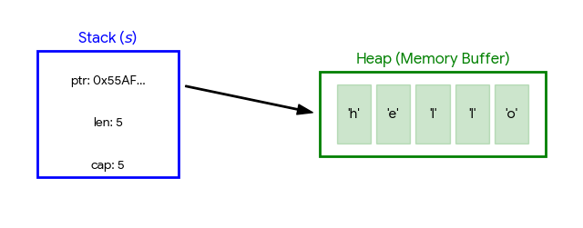

# 所有权

经过前面几章的铺垫,我们已经对 Rust 的内存模型、指针和作用域有了初步的了解,现在我们来深入探讨 Rust 的核心特性之一: **所有权**(Ownership)。

## 所有权规则

Rust 所有权规则可以总结为三句话:

- 每个值都有一个变量,这个变量是该值的**所有者**
- 每个值在任意时刻有且只能有**一个所有者**
- 当所有者(变量)离开作用域时,这个值将被**销毁**(调用 `drop` 并回收内存)

> **核心特性**: Rust 通过编译器在**语义层面**强制执行所有权规则,保证内存安全,避免了垃圾回收开销和野指针问题,这是 Rust 的核心设计理念之一。

### 所有权初体验

我们以下面这个简单的例子来说明所有权的转移(移动 Move) 过程:

```rust
let s = String::from("hello");
let s2 = s;
```

根据[内存和指针](./内存和指针.md)一章的知识,我们可以知道:

当执行 `let s = String::from("hello");` 时:

1. 在栈上开辟一块 24 字节的内存空间,将空间的起始地址和变量 `s` 绑定在一起。
2. 这块内存空间存储了一个指向堆上字符串数据的[超胖指针](./内存和指针.md#瘦指针与胖指针)。

这个超胖指针包含了指向堆上字符串数据的指针、字符串长度和容量等元信息。


当我们执行 `let s2 = s;` 时,发生了所有权转移(move):

1. 在栈上开辟一块 24 字节的内存空间,将空间的起始地址和 `s2` 绑定在一起。
2. 把 `s` 在 栈 上存储的超胖指针复制给了 `s2` 绑定的这块内存空间(浅拷贝)。
3. **重点**: 编译器在语义层面将 `s` 标记为无效,同时记录 `s2` 拥有了对堆上字符串数据的所有权
4. 堆上的 “hello” 字符串本体完全没有动过。

> 移动后原变量的不可访问和所有权变化都是编译器在语义层面进行的检查和记录,并不是内存层面的操作,因此没有性能开销。

### 谁是值的所有者

Rust中每个值都有一个所有者，但这个说法有时会引起误解。以下面的代码为例:

```rust
let s = String::from("hello");
```

你可能会认为变量 `s` 是堆上字符串数据 `"hello"` 的所有者,但严格来说并不是。

`String` 类型在**栈**上存储的是一个[胖指针](./内存和指针.md#瘦指针与胖指针)(包含指针、长度、容量三个字段),实际字符串数据存储在**堆**上。变量 `s` 绑定的是栈上的那个胖指针,因此 `s` 是**胖指针的所有者**,而不是堆中实际数据的所有者。

不过,由于胖指针指向堆中数据,为了简化描述,通常也会说"s 是那段字符串数据的所有者"。

## 移动 Move

当一个变量的值赋给另一个变量时,所有权会发生转移,这个过程称为**移动(Move)**。

```rust
let s = String::from("hello");
let s2 = s;              // 所有权从 s 转移到 s2
println!("{}", s);       // ❌ 编译错误: s 已失效
println!("{}", s2);      // ✅
```

具体过程参见上文的[所有权初体验](#所有权初体验)部分。

> **为什么要让 s 失效?** 如果 `s` 和 `s2` 都指向同一块堆内存,当它们离开作用域时会各自调用 `drop` 释放同一块内存,导致**[二次释放(double free)](./0.基础概念.md#二次释放)**,这是严重的内存安全问题。Rust 通过让 `s` 失效来杜绝这种情况。

> **Move 不是内存操作**: 移动后值的不可访问和所有权转移都是编译器在语义层面的检查和记录,并不是内存层面的操作,因此没有性能开销。

### 所有权转移后的可变性

发生 Move 后,新的所有者可以独立决定是否可变,与原变量无关:

```rust
let x = String::from("hello");
let mut y = x;            // 即使 x 是不可变的,y 可以声明为可变
y.push_str(" world");
println!("{}", y);        // 输出 "hello world"

let mut a = String::from("hello");
let b = a;                // 可变变量的所有权也可以转移给不可变变量
// b.push_str("!");       // ❌ b 是不可变的
println!("{}", b);
```

### Move 的性能

Move 操作本质上是对栈上数据的**浅拷贝**(如胖指针)加上语义层面的所有权转移,**不会拷贝堆数据**,因此性能开销很小。

对于 `Vec<T>`、`String` 这类复杂类型,即使发生了 Move,拷贝的也只是栈上的胖指针部分(24 字节),而不是整个数据。Rust 编译器也会对 Move 语义做进一步优化,在适当情况下直接传递指针而非内存拷贝。

### Move 的其他触发场景

除了赋值和函数传参，Move 还会在以下场景中隐式触发。

**解引用触发 Move**

对引用解引用时，会尝试将被引用的值 Move 出来。但引用没有所有权，因此编译器会报错：

```rust
let v = &vec![1, 2, 3];
let vv = *v;  // ❌ 错误：cannot move out of `*v` which is behind a shared reference
```

解决方法是克隆数据或只创建新引用：

```rust
let v = &vec![1, 2, 3];
let vv = (*v).clone(); // ✅ 克隆内部数据
let vv2 = &*v;         // ✅ 对被引用值再次创建引用，不消耗值
```

> 注意：`println!("{}", *v)` 不会报错，因为这类宏内部实际使用的是 `&(*v)`，是借用而非移动。

**被"丢弃"的 Move**

在语句中单独使用一个变量（不赋值给任何东西），也会触发 Move，等价于将值移动给一个立即丢弃的临时变量：

```rust
let x = "hello".to_string();
x;                    // Move 发生，等价于 let _ = x;，x 被消耗
println!("{}", x);    // ❌ 错误：value borrowed here after move
```

这个特性可用于主动丢弃值，或通过块表达式转移所有权：

```rust
let x = "hello".to_string();
let y = {
    x                 // Move x，通过块的返回值赋给 y. 注意:没有分号
};
println!("{}", y);    // ✅
// println!("{}", x); // ❌ x 已被移走
```

## Copy 语义

默认情况下,赋值操作是 Move 语义。但对于**实现了 `Copy` Trait** 的类型,赋值时会**自动复制**一份新的值,原变量仍然有效,这就是 **Copy 语义**。

```rust
let x = 5;
let y = x;                // x 实现了 Copy,自动复制一份给 y
println!("{}, {}", x, y); // ✅ x 仍然有效
```

### 实现了 Copy 的类型

Rust 中默认实现了 `Copy` Trait 的类型包括:

- 所有整数类型: `u8`、`i32`、`u64` 等
- 所有浮点数类型: `f32`、`f64`
- 布尔类型: `bool`
- 字符类型: `char`
- 元组,当且仅当所有字段都实现了 `Copy`: `(i32, i32)` ✅,`(i32, String)` ❌
- 数组,当且仅当元素类型实现了 `Copy`: `[i32; 5]` ✅,`[String; 5]` ❌
- 共享引用: `&T`(不可变引用实现了 `Copy`,复制引用不会转移所有权)

> **Copy 的本质是浅拷贝**: 只拷贝变量本身的值(栈上的数据),不拷贝其指向的堆数据。这也是 `String` 不能实现 `Copy` 的根本原因——若直接拷贝胖指针,会导致两个变量指向同一块堆内存,产生二次释放问题。

### 为自定义类型实现 Copy

对于没有实现 `Copy` 的自定义类型,可以通过派生宏来实现(要求同时实现 `Clone`):

```rust
#[derive(Copy, Clone, Debug)]
struct Point {
    x: i32,
    y: i32,
}

let p1 = Point { x: 1, y: 2 };
let p2 = p1;              // 自动 Copy,p1 没有转移所有权
println!("{:?}", p1);     // ✅ 打印: Point { x: 1, y: 2 }
println!("{:?}", p2);     // ✅ 打印: Point { x: 1, y: 2 }
```

> **注意**: 只有当类型的所有字段都实现了 `Copy` 时,才能为该类型实现 `Copy`。如果某个字段是 `String` 或 `Vec<T>` 等堆分配类型,则无法实现 `Copy`。

## 克隆 Clone

当需要**独立复制一份数据**(包括堆上的数据)时,使用 `clone()` 方法:

```rust
let s1 = String::from("hello");
let s2 = s1.clone();        // 深拷贝:堆上生成两份独立的字符串数据
println!("{}, {}", s1, s2); // ✅ 两个变量均有效
```

`Clone` 是**深拷贝**: 递归拷贝变量的所有数据,包括堆上的内容。数据量较大时性能开销较高。

### Copy 和 Clone 的区别

|          | Copy                      | Clone                       |
| -------- | ------------------------- | --------------------------- |
| 触发方式 | 赋值时**自动**执行        | 需要**手动**调用 `.clone()` |
| 拷贝范围 | **浅拷贝**,只拷贝栈上数据 | **深拷贝**,递归拷贝堆上数据 |
| 性能     | 高(只拷贝少量栈数据)      | 可能较低(取决于数据量)      |
| 实现要求 | 所有字段必须实现 `Copy`   | 所有字段必须实现 `Clone`    |

> 实现 `Copy` 时必须同时实现 `Clone`,但实现 `Clone` 不要求实现 `Copy`。

### 引用类型的 Clone

引用类型实现了 `Copy`,也实现了 `Clone`,但引用的 `clone()` 行为取决于**被引用类型是否也实现了 `Clone`**：

- **被引用类型未实现 `Clone`**：`clone()` 等价于 `Copy`，结果仍是一个引用（`&T`）
- **被引用类型实现了 `Clone`**：`clone()` **穿透引用**，克隆内部数据，结果是被引用类型本身（`T`）

```rust
struct Foo;        // 未实现 Clone

let a = Foo;
let b = &a;
let c = b.clone(); // c 的类型是 &Foo，只复制了引用本身

#[derive(Clone)]
struct Bar;        // 实现了 Clone

let x = Bar;
let y = &x;
let z = y.clone(); // z 的类型是 Bar，克隆了内部数据（而非引用）
```

这个行为源于 Rust 的**方法查找机制**：`.` 运算符会自动解引用，若被引用类型实现了 `Clone`，编译器优先找到被引用类型的 `clone()` 来调用，得到 `T`；否则只调用引用类型自身的 `Clone`（等价于 Copy），得到 `&T`。

在从集合中取数据时这个特性很实用：`HashMap::get()` 返回的是 `Option<&V>`，若 `V: Clone`，直接调用 `.clone()` 即可得到 `V`，而非 `&V`：

```rust
use std::collections::HashMap;
let mut map: HashMap<&str, String> = HashMap::new(); // 创建空 HashMap
map.insert("key", "hello".to_string());              // 插入键值对
if let Some(val) = map.get("key") {                  // 通过 get 获取到 &String
    let owned: String = val.clone(); // 得到 String，而非 &String
}
```

## 函数与所有权

### 函数传参

将值传给函数时,和变量赋值一样会发生 Move(或 Copy):

```rust
fn main() {
    let s = String::from("hello");
    takes_ownership(s);         // s 的所有权移动到函数内
    // println!("{}", s);       // ❌ s 已失效

    let x = 5;
    makes_copy(x);              // x 是 i32,发生 Copy
    println!("{}", x);          // ✅ x 仍然有效
}

fn takes_ownership(s: String) {
    println!("{}", s);
}   // s 离开作用域,堆上字符串被释放

fn makes_copy(n: i32) {
    println!("{}", n);
}   // n 离开作用域,栈上数据被清理
```

### 函数返回值

函数返回值也会发生所有权转移——从函数内部移动到调用方:

```rust
fn main() {
    let s1 = gives_ownership();        // 获得函数返回值的所有权
    let s2 = String::from("hello");
    let s3 = takes_and_gives_back(s2); // s2 所有权转入函数,s3 获得返回值所有权
    println!("{}, {}", s1, s3);
}   // s3 离开作用域被释放,s2 已被移走,s1 离开作用域被释放

fn gives_ownership() -> String {
    String::from("hello")             // 所有权转移给调用方
}

fn takes_and_gives_back(s: String) -> String {
    s                                 // 所有权再次转移给调用方
}
```

> **频繁转移所有权很麻烦**: 每次调用函数都要转进转出,写起来非常繁琐。实际开发中更常用的方案是传递**引用**,详见下文。

## 容器类型的所有权

容器类型(如元组 `tuple`、数组 `array`、`Vec`、`struct` 等)**拥有其内部所有元素值的所有权**。

当容器中某个元素的所有权被转移后,该元素将不可使用,整个容器也不可再使用:

```rust
let tup = (5, String::from("hello"));
let (x, y) = tup;            // 5 被 Copy,字符串所有权转移到 y
println!("{}, {}", x, y);    // ✅ 打印: 5, hello
println!("{}", tup.0);       // ✅ tup.0 是 i32,实现了 Copy
// println!("{}", tup.1);    // ❌ tup.1 的所有权已被转走
// println!("{:?}", tup);    // ❌ tup 不完整,不可使用
```

如果想让原始容器继续可用,有以下几种方式:

```rust
let tup = (5, String::from("hello"));

// 方式一: 用 _ 忽略需要 Move 的字段
let (x, _) = tup;        // i32 被 Copy 给 x，String 字段被 _ 忽略，不发生 Move
println!("{}", tup.0);   // ✅ tup.0 仍可访问
println!("{}", tup.1);   // ✅ tup.1 没有被 Move，仍可访问

// 方式二: Clone 整个容器
let tup2 = tup.clone();
let (x, y) = tup2;
println!("{}", tup.1);   // ✅ tup 没有被移动

// 方式三: 借用引用
let (x, ref y) = tup;
println!("{}", tup.1);   // ✅ y 是借用,没有发生 Move
```

## 引用 Reference: `&`

**引用**是一种不获取所有权的访问方式,本质是指向原数据的指针。

- **语法:** `&T`(不可变引用)、`&mut T`(可变引用)
- 引用本身存储在栈上,占用固定大小(一个指针的大小)
- 不可变引用实现了 `Copy`,可以自由复制和传递

```rust
// 不可变引用: 可以有多个,原变量仍保有所有权
let s = String::from("hello");
let r1 = &s;
let r2 = &s;              // ✅ 多个不可变引用可以共存
println!("{}, {}", r1, r2);

// 可变引用: 允许修改原数据
let mut s2 = String::from("hello");
let r3 = &mut s2;
r3.push_str(" world");
println!("{}", s2);       // 输出 "hello world"
```

> **引用 vs 所有权转移**: 引用只是借用,原变量保持所有权;而直接赋值会转移所有权。

### 引用位置语法

在**函数定义**中,`&` 永远加在**类型前面**,而不是变量名前面:

```rust
// ✓ 正确: & 加在类型 T 前面
fn execute<T>(item: &T) { ... }

// ✗ 错误: 不能加在变量名前面
// fn execute<T>(&item: T) { ... }
```

## 借用

**借用(Borrow)** 是通过引用访问数据而不获取所有权的行为。创建引用即是在借用。

```rust
fn main() {
    let s = String::from("hello");
    let len = calculate_length(&s);     // 借用 s,不转移所有权
    println!("{} 的长度是 {}", s, len); // ✅ s 仍然有效
}

fn calculate_length(s: &String) -> usize {
    s.len()
}
```

### 借用规则

在同一作用域内,对同一变量只能满足下列条件之一:

1. **任意数量**的不可变引用(`&T`)
2. **唯一一个**可变引用(`&mut T`)

```rust
let mut s = String::from("hello");
let r1 = &s;              // ✅ 不可变引用
let r2 = &s;              // ✅ 多个不可变引用可以共存
// let r3 = &mut s;       // ❌ 不能在有不可变引用的同时创建可变引用
println!("{}, {}", r1, r2);

let r4 = &mut s;          // ✅ r1、r2 已不再使用,可以创建可变引用
r4.push_str(" world");
```

> **设计原因**: 这条规则从根本上防止了**数据竞争(data race)**。数据竞争的发生条件是:两个或多个指针同时访问同一数据,且至少有一个用于写入,且没有同步机制。Rust 在编译阶段就杜绝了这种情况。

### 引用的作用域(NLL)

引用的作用域与普通变量有所不同:

- **旧版编译器(Rust 1.31 之前)**: 引用的作用域从定义到所在花括号结束
- **新版编译器(NLL,[非词法作用域生命周期](./作用域#非词法作用域生命周期))**: 引用的作用域从定义到**最后一次使用**的位置

这意味着下面的代码在新版编译器中是合法的:

```rust
let mut s = String::from("hello");
let r1 = &s;
let r2 = &s;
println!("{}, {}", r1, r2); // r1、r2 最后一次使用,作用域在此结束

let r3 = &mut s;            // ✅ r1、r2 已结束,可以创建可变引用
r3.push_str(" world");
println!("{}", r3);
```

> NLL 是 Rust 2018 Edition 引入的编译器改进,让借用规则更加灵活和人性化。

### 可变引用的排他性

可变引用的排他性比表面看起来更复杂。来看一个对比:

```rust
let mut x = String::from("hello");

let r1 = &mut x;
let r2 = &mut x;    // r1 和 r2 同时存在是合法的,但它们在同一时刻不能同时使用
println!("{}", r1); // ❌ r1 和 r2 在此同时有效,编译错误
println!("{}", r2);
```

去掉上面的第5行或者同时去掉第5行和第6行，又或者将第5行移到第4行之前，得到的代码都是可以正确执行的代码：

```rust
#![allow(unused)]
fn main() {
// 去掉上面的第5行,可以正确执行
let mut x = String::from("junmajinlong");
let x_mut1 = &mut x;
let x_mut2 = &mut x;
println!("{}", x_mut2);

// 同时去掉第5行和第6行,也可以正确执行
let mut x = String::from("junmajinlong");
let x_mut1 = &mut x;
let x_mut2 = &mut x;

// 将第5行移到第4行之前,也可以正确执行
let mut x = String::from("junmajinlong");
let x_mut1 = &mut x;
println!("{}", x_mut1);
let x_mut2 = &mut x;
println!("{}", x_mut2);
}
```

**本质理解**: 可变引用的排他性针对的是**同一时刻是否同时使用**,而非"是否在同一作用域内定义"。Rust 编译器借助 NLL 精确追踪每个引用的最后使用位置,只要不在同一时刻使用多个可变引用,就是合法的。

> **独占锁模型**: 将可变引用看作一把**抢占式独占锁**，是理解上述行为的另一个角度——从**第一次使用可变引用起，独占锁出现**；此后，每次通过原变量、新的可变引用或不可变引用来访问该数据，都会**抢占**这把锁，之前所有持有锁的引用变量**立刻失效**，只有当前抢占者可用；离开当前作用域时，锁释放。这解释了为什么多个可变引用可以先后存在，却不能同时使用：
>
> ```rust
> let mut x = String::from("hello");
> let r1 = &mut x;        // 独占锁出现，r1 持有锁
> let r2 = &mut x;        // r2 抢占独占锁，r1 失效
> println!("{}", r2);     // ✅ r2 持有锁，可用
> // println!("{}", r1);  // ❌ r1 已失效
> println!("{}", x);      // 原变量 x 抢占独占锁，r2 失效
> // println!("{}", r2);  // ❌ r2 已失效
> ```
>
> 独占锁模型引用自 [Rust入门秘籍](https://rust-book.junmajinlong.com/ch6/04_understand_mutable_ref.html)

## 解引用 `*`

通过解引用可以访问引用所指向的原始数据:

- 对不可变引用解引用: `*r` 获取原数据的只读访问
- 对可变引用解引用: `*r` 可以修改原数据

```rust
let x = 5;
let y = &x;
println!("{}", *y);   // 输出 5,解引用获取原数据

let mut a = 10;
let b = &mut a;
*b = 20;              // 解引用并修改原数据
println!("{}", a);    // 输出 20
```

> **自动解引用**: 调用方法时(`.` 操作符),编译器会自动处理解引用,无需显式 `*`。只有在手动修改值或数值运算等场景下才需要显式解引用。背后是通过实现 `Deref Trait` 来实现的。

## 重借用

从已有的**可变引用**创建新的引用称为**重借用(Reborrow)**:

```rust
let mut s = String::from("hello");
let r1 = &mut s;          // 可变引用
let r2 = &mut *r1;        // 从 r1 重借用,创建新的可变引用
*r2 = String::from("world");
// *r1 = ...;             // ❌ r2 存在时,r1 不可使用(借用规则)
println!("{}", s);        // 输出 "world"
```

> 重借用同样遵守借用规则。

## 引用规则总结

- 在任意给定时刻,要么只有**一个可变引用**(`&mut T`),要么只有**任意数量的不可变引用**(`&T`)
- 引用必须总是**有效的**(不能是[悬垂引用](./0.基础概念.md#悬垂引用))
